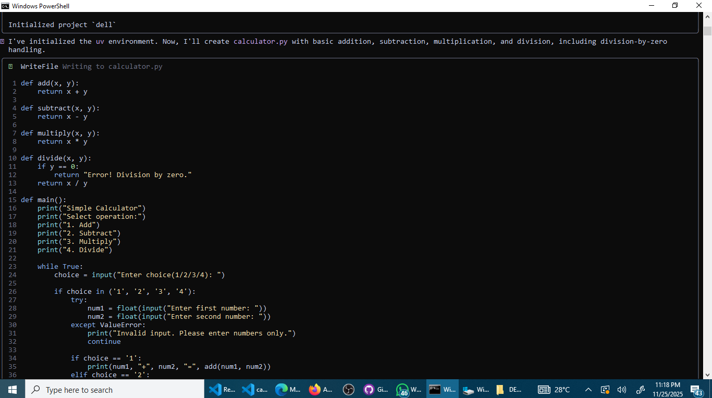

# GIAIC Quarter 4 - Class 5 Practical Task  
## 🔢 Simple Calculator using Gemini CLI

### 👤 Student Name: Riaz
### 🏫 Course: Governor Initiative for AI, Web 3.0 & Metaverse  
### 📌 Quarter: 4  
### 📅 Class: 5  

---

## 📚 Task Description

In this practical task, I created a **simple calculator** using the **Gemini CLI**.  
The calculator can perform basic operations like:

- Addition ➕  
- Subtraction ➖  
- Multiplication ✖  
- Division ➗  

This task helped me understand how AI tools like Gemini CLI can help in AI-driven development.

---

## 🛠 Tools Used

- Gemini CLI  
- Programming Language: [Python / JavaScript / etc]  
- Terminal / Command Line  

---

## 📂 Project Structure

